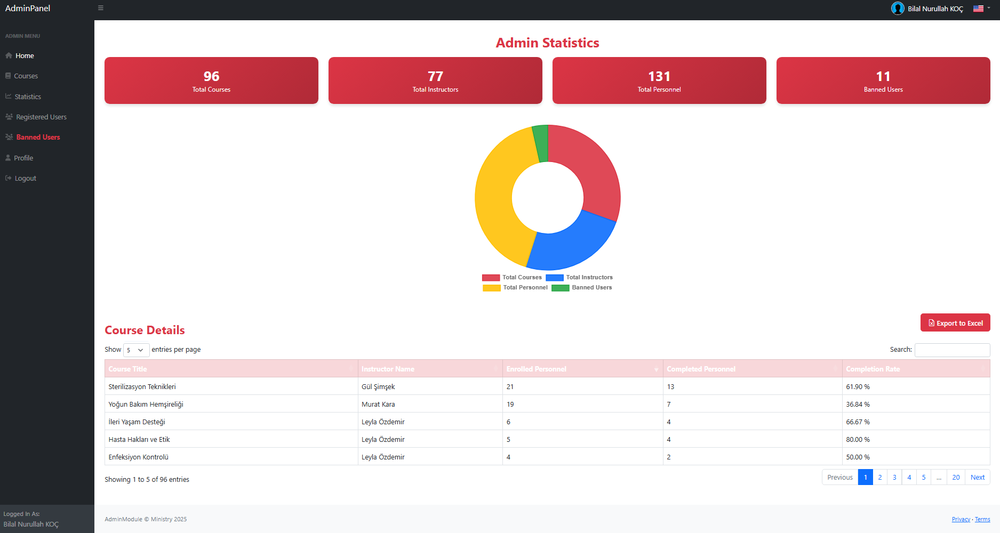
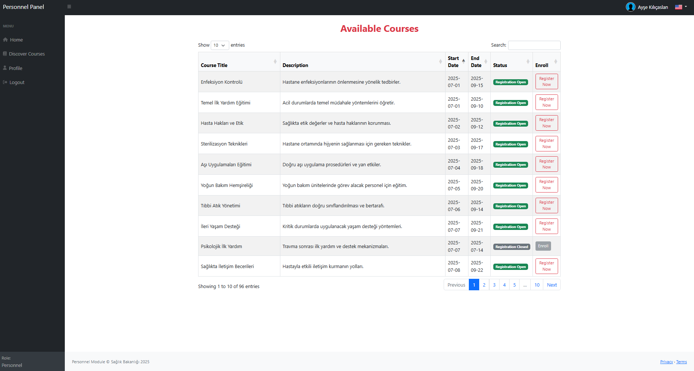
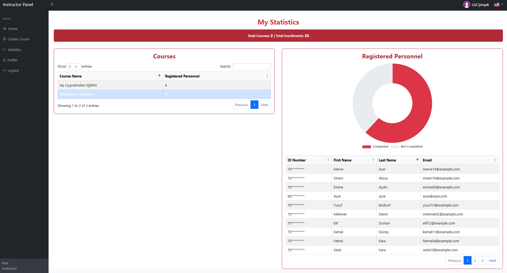

# MediLearn - Digital Training Platform for Healthcare Personnel

## 📌 About MediLearn

**MediLearn** is a modern, **web-based training system** specifically designed for healthcare personnel and instructors working under the Turkish Ministry of Health. It streamlines the entire training process by allowing healthcare professionals to access digital courses and assessments, while providing instructors and administrators with robust tools to effortlessly manage all training activities.

---

## 🚀 Key Features

MediLearn offers a comprehensive suite of features tailored for different user roles:

### 👨‍⚕️ Personnel Panel

* **Course Discovery & Enrollment:** Browse available courses and easily register for them.
* **Interactive Course Materials:** Read course materials in **PDF format** with intuitive step-by-step navigation.
* **Progress Tracking:** A "Finish Course" button activates upon completion of all material, ensuring a structured learning path.
* **Automated Quizzes:** Take **auto-generated quizzes** after completing course materials to test knowledge.
* **Performance & Completion Tracking:** Monitor course completion status and track overall success.
* **Profile Management:** Update personal details, including profile pictures, for a personalized experience.

### 👩‍🏫 Instructor Panel

* **Course Creation:** Create and manage new courses with ease.
* **Material Uploads:** Upload course materials in **PDF format**.
* **AI-Powered Quiz Generation:** Automatically generate quizzes using the **DeepSeek API**, saving valuable time and effort.
* **Quiz Management:** View and manage quizzes associated with each course.
* **Course Administration:** Edit or delete their own courses as needed.
* **Profile Customization:** Update profile details and profile pictures.

### 👨‍💼 Admin Panel

* **User Approval & Management:** Approve new instructors and personnel, and manage user bans.
* **System Analytics:** View system-wide statistics presented with insightful graphs for better oversight.
* **Comprehensive User Management:** View, edit, and delete all user accounts.
* **Security Controls:** Change the admin password for enhanced security.
* **Multi-language Support:** Seamlessly switch between Turkish (TR), English (EN), and French (FR) interfaces.

---

## 🛠️ Technologies & Integrations

MediLearn is built using a robust and modern technology stack:

| Layer             | Technologies                                                                   |
| :---------------- | :----------------------------------------------------------------------------- |
| **Backend** | ASP.NET Core MVC (C#), Entity Framework Core                                   |
| **Frontend** | Razor Pages, Bootstrap 5, jQuery, DataTables                                   |
| **Database** | Microsoft SQL Server                                                           |
| **AI Integration**| DeepSeek API for automatic quiz generation                                     |
| **PDF Viewer** | PDF.js for interactive, page-by-page PDF reading                               |
| **Auth System** | ASP.NET Cookie Authentication                                                  |
| **Localization** | ASP.NET Localization (IStringLocalizer)                                        |
| **Image Upload** | IFormFile + FileStream for efficient profile image processing (JPG/PNG support)|

---

## 🧩 Project Architecture

=======
The project follows a layered architectural approach for maintainability and scalability:
MediLearn/  
├── MediLearn.Web              --> UI Layer (Razor Views)  
│   ├── Controllers/  
│   ├── Views/  
│   └── wwwroot/  
├── Medilearn.Services         --> Business Logic Layer  
│   ├── Helpers/  
│   ├── Interfaces/  
│   └── Services/  
├── Medilearn.Data             --> Entities Layer  
│   ├── Context/  
│   ├── Entities/  
│   └── Enums/  
└── Medilearn.Models           --> DTOs, ViewModels Layer  
    ├── DTOs/  
    └── ViewModels/

 ---
  ## 📸 Screenshots 
  
Here's a glimpse of MediLearn in action: 

  --- 
  
  ### Admin Panel 
  
   
  
  --- 
  
  ### Personnel Panel 
   

--- 
### Instructor Panel - Manage Courses 

 
=======
 

--- 

## ⚙️ Local Setup Guide 
To get MediLearn up and running on your local machine, follow these steps: 

1. **Clone the Repository:** 
```bash git clone [https://github.com/bnk0dev/MediLearn.git](https://github.com/bnk0dev/MediLearn.git) ```
3. **Database Configuration:** 
Set up your **SQL Server database** and configure the connection string within the `appsettings.json` file. 
4. **Run Commands:** 
Navigate to the project directory and execute the following commands: 
```bash 
dotnet restore 
dotnet ef database update 
dotnet run
```

--- 

## 📬 Contact 

For any inquiries or collaborations, feel free to reach out: 
* **Developer:** Bilal Nurullah Koç
 * **LinkedIn:** [linkedin.com/in/bilalnurullahkoc](https://linkedin.com/in/bilalnurullahkoc) 

--- 

## 📦 APIs & External Services Used 

MediLearn leverages several powerful external services and libraries: 
* **DeepSeek API(SOON):** Used for intelligent **quiz generation** directly from course content. 
* **PDF.js:** Facilitates the rendering of course materials as interactive PDFs, enhancing the reading experience. 
* **DataTables:** Provides advanced features like powerful filtering, sorting, and pagination for clear and efficient data presentation in admin views.

## License

This project is licensed under the [MIT License](./LICENSE).